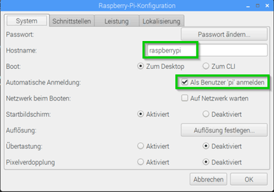
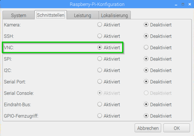
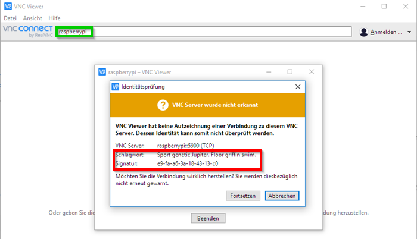
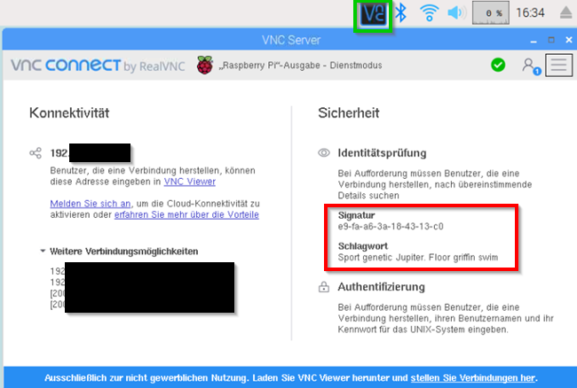
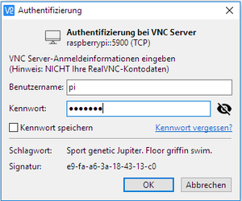
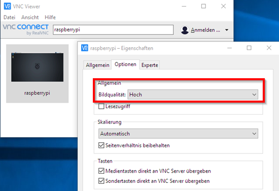

# Spielekonsole PiCo

In diesem Projekt werden wir die Spielekonsole _PiCo_ bauen. Das Herzstück der Hardware ist ein [Raspberry Pi](https://de.wikipedia.org/wiki/Raspberry_Pi) (aka RPi) - das Spiel _Lucky Luke_ werden wir in der Programmiersprache [Python](https://de.wikipedia.org/wiki/Python_(Programmiersprache)) selbst programmieren.

Das Besondere ist, daß wir für das Projekt nichts weiter als den RPi verwenden (Du benutzt keinen anderen Computer) - er beliefert uns mit Informationen aus dem Internet, stellt die Python-Entwicklungsumgebung bereit und ist die Spielekonsole. Insgesamt kostet die Spielekonsole nur 75 Euro - was selbst für Schüler ein erwschwinglicher Preis ist.

---

## Motivation und Ablauf

Wir wollen Dich in diesem Praktikum nicht abschrecken oder Dich mit unverständlichen Prozessen/Technologien langweilen. Stattdessen wollen wir Dich für die Welt der IT (insbesondere der Softwareentwicklung) begeistern. Sicherlich wird es im Berufsleben auch mal weniger spannende Phasen geben, doch die Freude bei der Realisierung von Problemlösungen wird überwiegen.

Zudem wirst Du einigen bisher vielleicht sehr [theoretischen Bereichen aus dem Schulunterricht](http://www.bildungsplaene-bw.de/,Lde/LS/BP2016BW/ALLG/GYM/PH/IK/7-8/05) begegnen und damit ein wenig arbeiten: Elektrotechnik ... wir machen aber nichts Wildes.

Es soll der Start für möglichst viele weitere interessante Projekte werden. Deshalb verwenden wir hier auch ausschließlich Tools, die Du zuhause auch benutzen kannst. Neben den technischen Fähigkeiten wirst Du Vorgehensweisen kennenlernen, die es Dir ermöglichen im Team zielstrebig Teilziele zu erreichen und deine Lösung immer weiter zu verbessern.

Wir stellen dieses Projekt unter Open Source, d. h. jeder auf der Welt wird Deinen Code sehen und erweitern können. Vielleicht findest Du Mitstreiter, zunächst mal in Deinem persönlichen Umfeld, später vielleicht verteilt auf der ganzen Welt. So kannst Du viele Leute aus verschiedenen Kulturen kennenlernen und von ihren technischen und persönlichen Erfahrungen profitieren. Du wirst sehen, daß man in einem kleinen effizienten Team erstaunlich große Dinge schaffen kann. In dieser Woche wirst Du nicht allein sein, denn Du bekommst einen Partner (= Betreuer), der mit Dir gemeinsam das Projekt machen durchführen wird ... ihr werdet also zwei Spielekonsolen bauen. Natürlich bekommt Ihr auch noch weitere Unterstützung bei Problemen/Fragen und bei der Einführung der Konzepte. ABER: Ihr seid die Projektleiter, Entwickler, Tester, Präsentatoren, ...

Wir haben uns dafür entschieden, Dich in die Welt von Linux und Python einzuführen. Gepaart mit Cloud-hosted Open-Source-Workflows (mit GitHub) hast Du alle Grundlagen, um als Softwareentwickler in den nächsten Jahren durchzustarten. Wir machen das Ganze auf einem Raspberry Pi, weil Du den auch einfach mit nachhause nehmen und an Deinen eigenen Ideen weiterarbeiten kannst. Außerdem ist es ein Einstieg in die aufkommende Welt der [Internet of Things](https://www.heise.de/tipps-tricks/Internet-of-Things-Was-ist-das-4292504.html), in der noch kleinere Computer wie der RPi genutzt werden. Deine Freunde können jederzeit mitmachen ... ein Invest von 75 Euro und ihr könnt zusammen hacken, vielleicht sogar mal verteilt über die ganze Welt.

Am Ende des Praktikums (Freitag 13:00 Uhr) wirst Du die Spielekonsole launchen, d. h. dem Team präsentieren und ein paar technische Details verraten. Den Höhepunkt bildet die _Lucky Luke Challenge_, ein Wettkampf um den reaktionsschnellsten Kollegen zu ermitteln. Natürlich wird das dann auch ordentlich gefeiert.

> Die Tage sind so aufgebaut, daß an jedem Tag mindestens ein [Minimum Viable Products (aka MVP)](https://de.wikipedia.org/wiki/Minimum_Viable_Product) entsteht, d. h. jedes MVP wäre am Freitag präsentierbar. Je weiter wir kommen desto kompletter ist der Launch des PiCo.

### Hardware

Für dieses Projekt brauchen wir folgende Komponenten:

* [Raspberry Pi 3 Modell B+](https://www.amazon.de/Raspberry-1373331-Pi-Modell-Mainboard/dp/B07BDR5PDW/ref=sr_1_3?__mk_de_DE=%C3%85M%C3%85%C5%BD%C3%95%C3%91&crid=SKVUEGOT7329&keywords=raspberry+pi+3+b%2B&qid=1558447193&s=gateway&sprefix=raspb%2Caps%2C147&sr=8-3)
  * der 3 B+ hat WLAN schon an Bord - man braucht also keinen externen USB Stick
  * 35 Euro
* Mini SD Karte - 16 GB
  * 7 Euro
  * das bekommst Du sicherlich geschenkt ... viele Leute haben zuhause alte Hardware, die sie nicht mehr brauchen
* Netzteil mit 2m Kabel
  * 10 Euro
  * in ein **richtig dimensioniertes Netzteil muß man investieren**, um seine Zeit nicht irgendwelchen seltsamen Phänomenen zu vergeuden. Ich kann hier aus eigener Erfahrungen sprechen, da ich mit einem schlechten Netzteil ganz schlechte Performance hatte (kaum bedienbar) und sogar Überhitzungen kam, die zum Einfrieren des Geräts und Probleme beim Neustart führten. Ein Ladegerät eines Handys sollte man nicht verwenden (auch wenn es von den Anschlüssen paßt), da

    > "Um einen Fehlkauf zu vermeiden, sollte man Netzteile nur dort kaufen, wo sie explizit als Zubehör für den Raspberry Pi erhältlich sind." ([Raspberry Pi: Das richtige Netzteil](https://www.elektronik-kompendium.de/sites/raspberry-pi/2002021.htm))

    > "Bei viele Steckernetzteilen, die typischerweise zum Laden von Smartphones und Tablets verwendet werden, handelt es sich nicht um Netzteile, sondern in der Regel um Ladegeräte für akkubetriebene Geräte. Diese Ladegeräte verlassen sich darauf, dass das damit versorgte Gerät keine stabile Spannung erwartet. Akkubetriebene Geräte werden typischerweise mit Strom geladen, wobei die Stabilität der Spannung aus dem Ladegerät völlig egal ist." ([Raspberry Pi: Grundlagen der Energieversorgung / Stromversorgung](https://www.elektronik-kompendium.de/sites/raspberry-pi/1912111.htm))

* [Raspberry Gehäuse inkl. Kühlkörper](https://www.amazon.de/Raspberry-geh%C3%A4use-iBetter%C2%AE-K%C3%BChlk%C3%B6rper-Transparent/dp/B01CPCMWWO/ref=sr_1_3?__mk_de_DE=%C3%85M%C3%85%C5%BD%C3%95%C3%91&crid=2J7NJ8SLFGQL6&keywords=raspberry+pi+3+b%2B+geh%C3%A4use+transparent&qid=1558447348&s=gateway&sprefix=raspberry+pi+3+b%2B+geh%C3%A4use+%2Caps%2C146&sr=8-3)
  * 7 Euro
* [Basic Starter Kit inkl. GPIO Extension Board](https://www.amazon.de/Freenove-Raspberry-Beginner-Processing-Tutorials/dp/B06WD5FTVD/ref=sxbs_sxwds-stvp?__mk_de_DE=%C3%85M%C3%85%C5%BD%C3%95%C3%91&crid=1J8XSDI6ASS4C&keywords=raspberry+starter+kit&pd_rd_i=B06WD5FTVD&pd_rd_r=9f5d7937-9b6f-4648-8377-cb066c29ac93&pd_rd_w=ECmgx&pd_rd_wg=Bjfdc&pf_rd_p=6d84c7ba-ae72-4e53-b9a4-5df18ccb370e&pf_rd_r=ER7FAQRN3734ETBRCXKS&qid=1558448017&s=gateway&sprefix=raspberry+starter%2Caps%2C140)
  * 13 Euro
* [Tastatur und Maus - USB - zur Not gebraucht](https://www.amazon.de/Desktop-Set-492015-Optische-Scrollrad-deutschem/dp/B00BLJDZ5Q/ref=sr_1_2?__mk_de_DE=%C3%85M%C3%85%C5%BD%C3%95%C3%91&keywords=maus+tastatur&qid=1558448148&s=gateway&sr=8-2)
  * 10 Euro
  * das bekommst Du sicherlich geschenkt ... viele Leute haben zuhause alte Hardware, die sie nicht mehr brauchen
* 17 Zoll Billdschirm - gebraucht (ein kleinerer genügt auch)
  * 15 Euro
  * das bekommst Du sicherlich geschenkt ... viele Leute haben zuhause alte Hardware, die sie nicht mehr brauchen
* [5m HDMI Kabel](https://www.amazon.de/AmazonBasics-T8FC_B_15-Geflochtenes-HDMI-Kabel/dp/B075ZX24H4/ref=sr_1_9?__mk_de_DE=%C3%85M%C3%85%C5%BD%C3%95%C3%91&keywords=hdmi+kabel&qid=1558448606&refinements=p_72%3A419118031%2Cp_89%3AAmazonBasics&rnid=669059031&s=gateway&sr=8-9)
  * 10 Euro

Man kann die Komponenten teilweise auch in Starter Kits gemeinsam erwerben - häufig sind sie aber gebundelt mit Teilen, die man (noch) nicht benötigt. Selbst wenn man alle Teile braucht, sind die Angebote meist nicht besser als beim Einzelkauf. Schaut einfach mal.

Fragt man also mal rum, so bekommt man vieles sicher von Leuten geschenkt, die froh sind ihre alte Hardware in gute Händezu geben. Vielleicht kann man sogar auch einen etwas älteren Raspberry PI auf diese Weise bekommen. Grundsätzlich könnte man auch den 5 Euro Raspberry PI Zero kaufen, doch muß man hier erstmal die GPIOs anlöten. Für den Schnellstart würde ich das nicht empfehlen.

---

## Reminder

Du kannst bei diesem Projekt eigentlich nichts kaputtmachen (abgesehen vielleicht bei den elektronischen Schaltungen, wenn Du Kurzschlüsse verursachst ... maximaler Verlust: 35 Euro). Du wirst Deine Software immer regelmäßig auf einen Server im Internet sichern (schon allein um Dich mit Deinem Betreuer zu synchronisieren), so daß Du jederzeit ohne großen Aufwand von vorn anfangen kannst. Du kannst auch jederzeit beim Raspberry Pi einfach den Stromstecker ziehen und das System startet ohne Datenverlust beim nächsten mal wieder ... Linux ist hier sehr zuverlässig.

... hab also keine Angst und spiel rum.

---

## Computer bauen

### 1. Schritt - Hardware-Zusammenbau

* Motherboard ins Gehäuse stecken
* Kühlkörper aufkleben
* Maus und Tastatur anschließen

### 2. Schritt - Betriebssystem installieren

Am einfachsten gelingt die Installation über [Noobs](https://de.wikipedia.org/wiki/Noobs) - das ist ein Betriebssystem-Installer, der auf die Mini-SD-Karte kopiert wird. Beim Start wird ein Menü angezeigt, über das man das gewünschte Betriebssystem auswählt.

> Im Internet kann man schon Mini-SD-Karten kaufen, auf denen sich der Noobs Installer befindet. Ich halte davon nicht viel, da man nie wissen kann, ob sich da tatsächlich der Original-Noobs Installer befindet oder man sich damit schon einen [Trojaner](https://de.wikipedia.org/wiki/Trojanisches_Pferd_(Computerprogramm)) installiert. Klar ist aber, daß man für den Download und das Kopieren auf die SD-Karte somit einen weiteren Computer benötigt - aber auch wirklich nur hierfür.

### Mini-SD-Karte formatieren

> Dieser Abschnitt wird übersprungen ... die Mini-SD-Karte ist bereits mit dem Dateisystem FAT32 formatiert und der Noobs-Installer ist darauf entpackt.

Die Mini-SD-Karte muß im FAT32 Dateisystem formatiert werden.

> Warum FAT32 und *NICHT* exFAT => [weitere Erklärung](https://de.minitool.com/datentraegerverwaltung/raspberry-pi-sd-karte-formatieren.html)

Hierzu verwendet man einen anderen Rechner - vorzugsweise einen Microsoft Windows Rechner. Die Mini-SD-Karte wird man vermutlich in einen SD-Karten-Adapter  (da es kaum Laptops gibt, die einen Mini-SD-Karten-Leser haben) und evtl. nochmal in einen SD-to-USB-Adapter stecken müssen (da es auch nur noch wenige Laptops mit SD-Karten-Leser gibt).

> ACHTUNG: mit einem SD-Card-auf-USB-Adapter (weil mein Rechner keinen SD-Card-Clot hatte) hatte ich schon mal das Problem, daß die SD-Karte angeblich schreibgeschützt war (obwohl das SD-Karten-Lock-Schalter richtig gestellt war)

Zum Formatieren stehen zwei Varianten zur Verfügung, die [hier beschrieben sind](https://www.gieseke-buch.de/raspberrypi/sd-karte-vom-raspberry-pi-windows-vollstaendig-nutzen)

* Variante 1: mit Windows Bordmitteln - ACHTUNG: bei unsachgemäßer Verwendung kann man sich das Windows-System zerschießen
  * Windows Console öffnen (Win-R, `cmd` eingeben und Return drücken)
  * in der Console den Befehl `diskpart` eingeben und Return drücken
    * nun muß man bestätigen, daß man `diskpart` Änderungen am System erlauben möchte
  * in der DISKPART-Console nun folgende Befehle ausführen:
    * `list disk`
    * `select disk X`
      * `X` muss man durch die Nummer der SD-Karten-Disk ersetzen ... erkennt man am besten an der Größe (nicht mit der Festplatte des Windows Systems verwechseln!!!)
    * `clean`
    * `create partition primary`
    * `format quick`
* Variante 2: mit dem Tool [SD Memory Card Formatter](https://www.sdcard.org/downloads/formatter/) - die sichere Variante, weil das nur USB/SD-Karten zum Formatieren anbietet ... die Windows Partition kann man nicht wählen

### Noobs-Installer auf die Mini-SD-Karte kopieren

> Dieser Abschnitt wird übersprungen ... die Mini-SD-Karte ist bereits mit dem Dateisystem FAT32 formatiert und der Noobs-Installer ist darauf entpackt.

Hierzu den [Noobs Installer runterladen](https://www.raspberrypi.org/downloads/noobs/). Am besten nimmt man den Full-Installer anstatt des Lite-Installers, da dieser ohne Internetverbindung auskommt, um das Betriebssystem Raspbian zu installieren. Verwendet man den Lite-Installer, dann muß man im Nooby-Installer zunächst das WLAN konfigurieren ... auch kein Problem, denn das braucht man später ja sowieso. Ich empfehle den ZIP-Download anstatt des Torrents.

Den Inhalt des Noobs Zip-Archivs entpackt man auf die SD-Karte (z. B. per Windows Explorer).

### Betriebssystem Raspbian installieren

Mini-SD-Karte in den RPi stecken und Strom-Stecker anstecken, damit während des Bootens der Noobs-Installer gestartet wird.

> Will man nur Raspbian installieren, dann braucht man keine WLAN-Konfiguration vornehmen. Will man gleich weitere Software installieren, dann muß man die WLAN-Konfiguration vornehmen (diese Software kommt aus dem Internet). Weitere Software läßt sich später aber komfortabel nachinstallieren.

Wir konfigurieren folgendes:

* _Raspbian Full_ zur Installation auswählen
  * _Raspbian Light_ hätte keine grafische Oberfläche
* Sprache auswählen ... wir nehmen _Deutsch_
* Tastatur Layout _de_ auswählen

Zum Schluß auf den Button _Installieren_ clicken. Bei dieser Auswahl werden ca. 4,5 GB belegt ... also genug Speicher für weitere Programm-Installationen. Die Installation dauert eine Weile, da die SD-Karte nicht die schnellste ist.

> Hier kann man übrigens auch gleich mehrere Betriebssysteme installieren, die vom Noobs Installer zur Verfügung gestellt werden. Diese Betriebssysteme landen dann alle auf der SD-Karte, allerdings in verschiedenen getrennten [Partitionen](https://de.wikipedia.org/wiki/Partition_(Datentr%C3%A4ger)), so daß sie voneinander getrennt sind. Wir arbeiten hier aber nur mit einem Betriebssyste ... Raspbian.

### Erster Systemstart

Nach dem ersten Systemstart wird man durch die Basis-Konfiguration geführt.

Das wichtigste ist die Vergabe eines Passwort für den user `pi`.

> Linux Systeme haben zudem noch den User `root` - dessen Passwort benötigt man nicht, da man Befehle entweder per `sudo befehl` als `root` User ausführt oder sich eine Shell per `sudo bash` besorgen kann.

Zudem wird noch das WLAN konfiguriert (das haben wir allerdings schon im Noobs Installer getan) und das System aktualisiert (auch das dauert eine Weile). Es erfolgt ein Neustart des Systems. Das Starten des Computers dauert ca. 30 Sekunden.

> Änderungen an der Konfiguration kann man auch im nachhinein noch über "RPi Menü - Einstellungen - Raspberry-Pi-Konfiguration" oder `sudo raspi-config` über das LXTerminal vornehmen. Über letzteres kann man beispielsweise die [Bildschirm-Auflösung konfigurieren](https://www.elektronik-kompendium.de/sites/raspberry-pi/2101201.htm) oder der Start des System auf die Textkonsole oder die grafische Oberfläche erfolgen soll (mit Autp-Login des Users `pi` oder nicht).

Bei der Nutzung solltest Du darauf achten, daß im rechten oberen Bereich **KEIN BLITZ** zu sehen ist. Wenn doch, dann ist das ein Indiz, daß die Stronversorgung nicht stabil ist. Das könnte zu Abstürzen oder Performanceenbußen führen. Du solltest ein ordentliches Netzteil verwenden und kein Handy-Ladegerät!!!

### System-Upgrade

Nach dem ersten Start bringen wir Dein System erst einmal auf den aktuellen Stand.

> Der Noobs Installer, der für die Erstinstallation zuständig war, ist vermutlich schon ein wenig veraltet und enthält noch nicht die letzten Neuerungen. Es ist immer wichtig regelmäßig Betriebssystem- und Software-Updates zu machen, um das System sicher zu gestalten - Hacker finden immer mal wieder Lücken, die unter Linux aber zeitnah geschlossen werden.

Öffne das "RPi Menü - Zubehör - LXTerminal" und führe diesen Befehl aus:

```bash
sudo apt-get update && sudo apt-get dist-upgrade
```

Das dauert eine Weile ... danach solltes Du Deinen RPi neu starten.

### Raspbian

Die grafische Oberfläche erinnert an Microsoft Windows, es handelt sich aber um ein Linux System, das mit sehr geringen Ressourcen auskommt (bei 35 Euro für die Hardware kann man keine Super-Power erwarten) und dennoch flüssig zu bedienen ist.

Hier die wichtigsten Features, die Du in den ersten Aufgaben kennenlernen wirst:

* Web-Browser: Dein Tor, um weitere Informationen zu beschaffen und weitere Software zu installieren
* Datei-Explorer: zum Navigieren durch das Dateisystem
* Terminal: zum Ausführen von Kommandos

---

## Aufgabe: Personalisieren der Oberfläche

Suche im Internet ein Bild von Lucky Luke, das ihn in einer typischen Art zeigt und mache es zum Hintergrundbild deines Desktops.

> "zieht den Colt schneller als sein eigener Schatten" ([Lucky Luke - Wikipedia](https://de.wikipedia.org/wiki/Lucky_Luke))

---

## Exkurs: Linux

[Linux](https://de.wikipedia.org/wiki/Linux) bezeichnet eigentlich nur den Kernel, der Teil des Betriebssystems, der die Hardware anspricht und sich um die CPU-Nutzung, Speichermanagement, Ein-/Ausgabe kümmern. Der Kernel ist ALLEN [Linux-Distributionen](https://de.wikipedia.org/wiki/Liste_von_Linux-Distributionen) gleich (es gibt aber verschiedene Kernel-Versionen).

> Erfinder des Linux Kernels ist [Linus Torvalds](https://de.wikipedia.org/wiki/Linus_Torvalds), der den Linux Kernel während seines Studiums programmierte. Anstoß war das [Lehr-Betriebssystem Minix](https://de.wikipedia.org/wiki/Minix_(Betriebssystem)) von [Andrew S. Tanenbaum](https://de.wikipedia.org/wiki/Andrew_S._Tanenbaum), von dem Linus in einem [Buch](https://www.amazon.de/Operating-Systems-Design-Implementation-Tanenbaum/dp/0135053765) las. Er wollte es verstehen und verbesserte es ... damals dachte es sicher nicht daran mit diesem privaten Forschungsprojekt [die IT-Welt zu verändern](http://www.itplatz.net/der-wahre-marktanteil-von-linux-ist-groesser-als-sie-denken/). Er hat als unbekannter Student angefangen, seine Neugier, seine Hartnäckigkeit und seine Kompetenz haben ihn das schaffen lassen.

> "W3Techs geht noch einen Schritt weiter und behauptet, dass Linux rund 70 Prozent der Top-10-Millionen-Alexa-Domains erreicht. Windows kontrolliert die restlichen 30 Prozent." ([it-platz.net](http://www.itplatz.net/der-wahre-marktanteil-von-linux-ist-groesser-als-sie-denken/])

Du bist sicher auch schon mal mit Linux-basierten System in Berührung gekommen, ohne es vielleicht zu wissen. Android (Betriebssystem für Smartphones/Tablets), Chromebooks sind nur die offensichtlichen Vertreter. [Viele Haushaltsgeräte und andere Embedded-Systeme basieren auf Linx](https://www.zdnet.de/41555951/20-jahre-linux-so-hat-das-os-die-welt-veraendert/) - Eure Fritzbox zuhause genauso wie der Fernseher vielleicht und das Navigationssystem im Auto.

Eine Linux Distribution besteht also aus dem Kernel und vielen weiteren Softwarepaketen (z. B. die grafische Oberfläche). Die meisten Linux-Distributionen sind kostenlos - du bekommst also ein komplettes Betriebssystem und viele tolle Anwendungen geschenkt. Und das tolle ist, daß alles kostenlos weiterentwickelt wird. Das ist nur möglich, weil sich der [Open-Source-Gedanke](https://de.wikipedia.org/wiki/Open_Source) mit Aufkommen von Linux (in den 1990er Jahren) immer weiter verbreitet hat und immer mehr Teilnehmer fand.

> Um noch genauer zu sein ist die Idee der [Free Software Foundation](https://de.wikipedia.org/wiki/Free_Software_Foundation) noch älter und geht auf [Richard Stallmann](https://de.wikipedia.org/wiki/Richard_Stallman) zurück. Aus dieser Initiative ist mit den [GNU-Tools](https://de.wikipedia.org/wiki/GNU-Projekt) viel Software entstanden, die heute AUCH in einer Linux-Distribution enthalten ist. Diese GNU-Tools machen die Kommandozeile unter Linux besonders mächtig. Schau mal in die Liste der [GNU Core Utilities](https://de.wikipedia.org/wiki/GNU_Core_Utilities) ...

Du siehst, daß die Beschäftigung mit Linux eine gute Investition in Dein Wissen ist ... wenn Du mal ein Softwareentwickler werden willst, dann starte mit Linux zu arbeiten.

### Paketmanager

Die Distributionen bieten einen sog. [Paketmanager](https://de.wikipedia.org/wiki/Paketverwaltung) (die Distributionen unterscheiden sich darin welchen Paketmanager sie verwenden), um weitere Software nach der Installation des Grundsystems zu installieren.

> Raspbian basiert auf Debian und Debian verwendet das [Advanced Packaging Tool (APT)](https://de.wikipedia.org/wiki/Advanced_Packaging_Tool). Im den nachfolgenden Kapiteln wirst Du immer mal wieder auf Befehle wie `apt-get install ...` treffen. Linux-typisch handelt es sich dabei um ein [Command-Line-Interface (aka CLI)](https://de.wikipedia.org/wiki/Kommandozeile) von APT. Es gibt aber auch grafische Tools um Software zu verwalten (installieren und deinstallieren). Beim RPi findest Du es unter "Menü RPi - Einstellungen - Add/Remove Software".

Ein Paketmanager hat den Vorteil, daß Du mit einem Einzeiler (`sudo apt-get update && sudo apt-get dist-upgrade`) Dein ganzes System aktualisieren kannst ([mehr Details](https://www.elektronik-kompendium.de/sites/raspberry-pi/2002041.htm)). Also nicht nur Dein Betriebssystem, sondern auch die gesamten Anwendungen, die Du nachträglich installiert hast. Das ist unter Windows so nicht möglich und muß in Unternehmen mit viel Aufwand nachgebaut werden. Du hast es sogar schon auf Deinem RPi für 35 Euro.

---

## Aufgabe: Installiere _Kodi Media Center_ über die grafische Oberfläche

Verwende "Menü RPi - Einstellungen - Add/Remove Software", um das _Paket_ (= Anwendung) `kodi` zu installieren.

Finde zwei Möglichkeiten, [Kodi](https://kodi.tv/) zu starten.

Fragen:

* Was fällt Dir beim Start auf?
  * TODO-ANTWORT: es sieht gar nicht mehr nach einem Betriebssystem aus ... wenn der RPi gleich diese Anwendung starten würde, dann hätte man gar nicht mehr den Eindruck, daß es sich um einen Computer handelt, sondern eher ein professionelles Consumer-Gerät aus dem High-End-Hifi Bereich.
* Du findest sicher ein paar Einsatzbereiche für Kodi zuhause ... Projekte, bei denen man nicht sofort an einen Computer oder einen 35-Euro Raspberry Pi denkt.
* Könnten wir Kodi auch für unsere Spielekonsole verwenden? Welche Vorteile hätte das?

---

## Aufgabe: Installiere _Gimp_ über Kommandozeile

> [Gimp](https://www.gimp.org/) ist ein kostenloses Bildbearbeitungsprogramm, das viele Features professioneller Bildbearbeitungsprogramme von beispielsweise Adobe besitzt ("GIMP ist ein Klassiker und der wohl leistungsstärkste Photoshop-Konkurrent." ([PC-Welt](https://www.pcwelt.de/ratgeber/Gratis-Bildbearbeitung-Alternativen-zu-Adobe-Photoshop-142877.html))). Es ist auch unter Windows verfügbar.

Öffne ein LXTerminal und führe folgende Befehle aus:

```bash
sudo apt-get update
sudo apt-get install gimp
```

Starte anschließend einmal kurz Gimp ... wir wollen das Thema Bildbearbeitung jetzt aber nicht vertiefen. Diese Übung sollte Dir nur eine zweite Variante aufzeigen wie man Software an einem Linux-System nachinstalliert.

> BTW: Über "Fenster - Einzelfenster-Modus" kannst Du die Einzeldocks (Einzelfenster) von Gimp zu einem einzigen zusammenfügen ... mir gefällt diese Darstellung besser.

---

## Aufgabe: GitHub ohne eigenen Account benutzen

> [GitHub](https://github.com/) ist ein kostenloses Tool, das den Software-Anteil von PiCo hostet (die Dateien dort sammelt) und Dir Werkzeuge zur Planung und Durchführung Deines Projekts bereitstellt. Es hilft Dir bei der Zusammenarbeit mit anderen Entwicklern - dein Code, die Dokumentation, ... ist für jeden im Internet sichtbar.

Wir haben dieses Projekt bereits bei GitHub angelegt: https://github.com/mobi3006/pico

> Derzeit befindet sich dort nur diese Beschreibung. In den nächsten Tagen werdet Ihr weitere Teile beisteuern.

Mach diese Seite am besten gleich mal zur Startseite in Deinem Web-Browser.

---

## Exkurs Git

[Git](https://de.wikipedia.org/wiki/Git) ist ein verteiltes Versionsverwaltungs-Tool. Hier wird i. a. Source-Code und Dokumentation in Form von Textdateien in einem sog. GIT-Repository gespeichert. Man verwendet Textdateien, weil man die sehr schön vergleichen kann. *DIESES* Dokument ist auch in einer Textdatei (mit dem Namen `readme.md`) gespeichert.

Würde ich jetzt die Überschrift von

```
Exkurs Git
```

nach

```
Exkurs Git Versionsverwaltung
```

ändern, so würde ich diese Datei als geändert angezeigt bekommen und genau diese eine geänderte Zeile (in dem langen Dokument) als Veränderung gegenüber dem alten Stand erkennen.

Wenn man nun it vielen Leuten an einem GIT-Repository arbeitet - teilweise verteilt auf der ganzen Welt in unterschiedlichen Zeitzonen, dann kann es passieren, daß man an der gleichen Datei arbeitet. GIT hilft hier, daß dies keine großen Probleme verursacht.

Die wichtigsten Befehle, die wir verwenden werden sind:

* `git clone`
* `git add meine-datei.md`
* `git commit -m "erste Version der grafischen Oberfläche für Lucky Luke implementiert"`
* `git push`
* `git pull`

Diese Befehle gehören zu dem Command-Line-Interface (aka CLI) von GIT. Sie werden in auf der Console (z. B. in einem LXTerminal) eingegeben. Keine Sorge es gibt auch grafische Programme, die einfacher zu bedienen sind (im Hintergrund führen die aber genau diese Befehle aus).

> Softwareentwickler lieben die Console, weil sie sehr mächtig ist und Automatisierung von immer wiederkehrenden Aufgaben ermöglicht. Hierzu kann man die sog. [Shellprogrammierung](http://openbook.rheinwerk-verlag.de/shell_programmierung/) verwenden, auf die wir in diesem Praktikum aber nicht eingehen werden.

---

## Aufgabe: Eigenen GitHub Account nutzen

> Im Vorfeld hast Du Dich schon - zusammen mit Deinen Eltern - bei GitHub angemeldet und kennst Username und Passwort.

Melde Dich mit Username/Passwort bei GitHub im WebBrowser an und mach das Lucky Luke Bild zu deinem Profilbild.

---

## Aufgabe: GIT-Repository lokal bearbeiten

Das Repository https://github.com/mobi3006/pico ist auf dem Server von GitHub, doch wenn Du es erweitern möchtest, dann willst Du die Dateien verändern und das möchtest Du auf Deinem eigenen Raspberry Pi tun. Das Repository muß also runtergeladen werden.

Das GIT-Command-Line-Tool ist bereits auf dem Raspberry Pi vorhanden ... öffne ein LX-Terminal und `clone` das Repository mit folgendem Befehl auf Deinen Raspberry Pi:

```bash
cd ~
git clone https://github.com/mobi3006/pico.git
```

Anschließend wird das Repository auf Deinen Raspberry Pi runtergeladen ... ins Verzeichnis `~/pico`. Es steht nun zu Deiner Verfügung - Du kannst Änderungen machen. Öffne doch einfach mal diese Beschreibung (`~/pico/readme.md`) im Editor (RPi Menü - Zubehör - Text Editor).

> Vielleicht wunderst Du dich über diese komische Formatierung in der Textdatei. Hierbei handelt es sich um die sog. [Markdown-Syntax](https://de.wikipedia.org/wiki/Markdown), die gerne in Open-Source-Projekten verwendet wird. Vergleiche diese Darstellung im Editor am besten mal mit der Darstellung der Datei im [Web-Browser](https://github.com/mobi3006/pico/blob/master/readme.md). Was fällt Dir auf?

Jetzt leg doch am besten gleich mal eine Datei mit Deinem Namen an und schreibe rein `hallo`.

Führe nun diese GIT-CLI-Kommandos aus:

```bash
cd ~/pico
git add .
git commit -m "meine erste Datei`
git push
```

Schau jetzt mal im Webbrowser auf das Repository - hat sich etwas verändert?

Sobald Dein Betreuer das auch getan hat, könnt Ihr beide diesen Befehl ausführen:

```bash
git pull
```

Was fällt Dir auf Deinem lokalen Repository auf?

Nun hast Du die wichtigsten GIT-Befehle schon kennengelernt - mehr ist für den Anfang nicht nötig und wir werden zukünftig auch ein grafisches Programm (Visual Studio Code) dafür verwenden. Das ist am Anfang komfortabler.

## Aufgabe: Visual Studio Code nutzen

Visual Studio Code (aka VSC) ist ein Tool der Firma Microsoft, die auch das Betriebssystem Microsoft Windows bereitstellen. Dieses Tool ist so beliebt bei Entwicklern, daß es auch seinen Weg in die Linux-Welt gefunden hat (also in ein Konkurrenz-Betriebssystem).

Allerdings ist der Raspberry Pi (mit seinem Prozessor basierend aif der [ARM-Architektur](https://de.wikipedia.org/wiki/ARM-Architektur)) nicht die Zielarchitektur von Microsoft. Deshalb hat [Jay (aka `headmelted`)](https://twitter.com/headmelted) seine Freizeit genutzt, um Visual Studio Code auf die ARM-Architektur zu portieren: https://code.headmelted.com/

Führe folgende Befehle aus:

> `sudo bash` benötigst Du, um eine `root`-User Console/Shell zu bekommen, mit der Du Änderungen am Betriebssystem (hier die Softwareinstallation) vornehmen kannst. [Hier](https://wiki.ubuntuusers.de/Benutzer_und_Gruppen/) erfährst Du mehr darüber, [hier eine kurze Einführung in Linux](https://www.ernstlx.com/linux90linux.html) ... wir werden nicht weiter darauf eingehen. Vielleicht hast Du ja Lust, das Wissen in den Sommerferien zu vertiefen ... die meisten Server im Internet basieren auf Linux - ein fundiertes Wissen in dem Bereich ist auf jeden Fall hilfreich. Auch in diesem Beispiel siehst Du, daß der sichere Umgang mit der Console bei Linux essentiell ist - keine Angst ... es ist kein Hexenwerk und Du findest im Internet viele gute Beispiele.

```bash
sudo bash
wget -qO - https://packagecloud.io/headmelted/codebuilds/gpgkey | sudo apt-key add -;
echo "deb https://packagecloud.io/headmelted/codebuilds/debian/ stretch main" > /etc/apt/sources.list.d/headmelted_vscode.list
apt-get update
apt-get install code-oss=1.29.0-1539702286
apt-mark hold code-oss
exit
```

Am Anfang ist das sicher ein wenig viel Input, um alles von der Konsole zu machen ... aber das sollte Dein Ziel sein. Software kannst Du auch über ein grafisches Tool unter "Menü RPi - Einstellungen - Add/Remove Software" installieren/deinstallieren.


> ACHTUNG: die aktuelle Version (1.32.x) der von `headmelted` bereitgestellten _Visual Studio Code_-Ports führt beim Starten zu einem schwarzen Bildschirm. Deshalb verwenden wir die Version `1.29.0-1539702286` und mit `apt-mark hold code-oss` verhindern wir, daß bei einem Betriebssystem-Update per `sudo apt-get update && sudo apt-get dist-upgrade` (weitere Details zu einem [Raspbian-Upgrade findest Du hier](https://www.raspberrypi.org/documentation/raspbian/updating.md)) eine neuere Version installiert wird und der schwarze Bildschrim wieder zum Problem wird. Ich habe das auch nur durch Suche über Google rausgefunden und bin auf [diese Beschreibung](https://github.com/headmelted/codebuilds/issues/73) gestoßen. Dort war dieser Workaround angegeben. Irgendwann ist das Problem vielleicht behoben und ich kann die Upgrade-Sperre per `apt-mark unhold code-oss` aufheben.

Starte Visual Studio Code per `code-oss` von der Console oder über das Menü (Menu RPi - Entwicklung - Code - OSS (handmelted)). Dein Betreuer wird Dir zeigen wie Du

* dein lokales `pico`-Git-Repository in Deinen Visual Studio Code Workspace bekommst
  * Hinweis: nicht vergessen "File - Save Workspace As ..." damit der Workspace beim nächsten Start wieder genauso aussieht
* `pico/readme.md` in einer Preview-Ansicht besser lesen kannst
* von Visual Studio Code aus Markdown ein PDF erzeugen läßt (vielleicht kannst Du es für Deine Praktikumsdokumentation nutzen)
  * Extensions `Markdown PDF` von `yzane` und `vscode-pdf` von `tomoki1207` installieren und VSC restarten
  * über "File - Preferences - Settings" nach `markdown-pdf: Executable Path` folgendermaßen setzen

    ```json
    {
        "markdown-pdf.executablePath": "/usr/bin/chromium-browser", 
        "markdown-pdf.convertOnSave": true
    }
    ```

    >  Diese Konfiguration erfolgt im sog. [JSON-Format](https://de.wikipedia.org/wiki/JavaScript_Object_Notation) und wird auf dem Dateisystem Deines RPi unter `~/.config/Code - OSS (headmelted)/User/settings.json` abgelegt. Solche Konfigurationen eignen sich übrigens auch sehr gut, um sie in einem GIT-Repository abzulegen

  * anschließend sollte bei einer Änderungen an `readme.md` gleich ein `readme.pdf` erzeugt werden
* Git benutzt

> Vielleicht wunderst Du Dich warum Visual Studio Code im Menü unter _Entwicklung_ landet. Später werden wir Visual Studio Code so erweitern, daß wir es zum Programmieren von Python-Code (editieren, ausführen, debuggen) verwenden können. Visual Studio Code ist sehr mächtig.

---

## Aufgabe: Python Programme starten

Unter "Menü RPi - Spiele - Python Games" findest Du ein paar einfache Spiele. Starte `wormy` und spiel es ein paar mal.

---

## Exkurs: Python

[Python ist sehr beliebt](https://www.grapecity.com/blogs/the-growth-of-major-programming-languages), weil sie einfach zu erlernen ist - die meisten RPi Projekte setzen auf Python ... und deshalb verwenden wir es hier auch. Außerdem wird Python interpretiert, d. h. man ändert den Source-Code und die Änderungen sind bei Neustart sofort sichtbar.

> Bei einer compilierten Sprache wie Java muß der Source-Code zunächst mit einem Compiler in ein anderes Format gebracht werden. Das ist natürlich umständlicher. Java ist auch eine sehr gute Sprache für das Erlernen objektorientierter Programmierung - auch sie wird auf dem Raspberry Pi unterstützt (sogar schon vorinstalliert) und Visual Studio Code unterstützt es auch.

Diese Sprache gibt es in zwei derzeit weiterentwickelten Versionen - Version 2 und Version 3 ([Was ist der Unterschied?](https://learntocodewith.me/programming/python/python-2-vs-python-3/#2018-differences-of-python2-vs-3)). Wir werden hier Python 3 verwenden, da das die Zukunft ist ... Python 2 wird eigentlich nur noch aus Kompatibilitätsgründen weitergeflegt:

> "Keep in mind that Python 2.7 will no longer be supported after 2020, so dedicating effort to learning it at this point won't make sense for most folks." ([Python 2 vs. Python 3](https://learntocodewith.me/programming/python/python-2-vs-python-3/))

Tatsächlich ist Python aber nicht nur eine gute Sprache für den Start, sondern ist im professionellen Umfeld sehr verbreitet:

> "Python gewinnt mit großem Abstand den Titel der beliebtesten Programmiersprache über alle Altersgruppen hinweg." ([entwickler.de](https://entwickler.de/online/development/programmiersprachen-go-python-579827892.html))

[Hier](https://www.learnpython.org/) findest Du eine kurze interaktive (!!!) Einführung in Python - wir benötigen für das Praktikum nur die Basics. Von "Hello World" bis "Loops".

Eine vollständige Dokumentation von Python findest Du [hier](https://docs.python.org), aber keine Angst ... wir brauchen nur ganz wenige Sprachkonstrukte.

Hast Du schon rausgefunden [warum die Sprache Python heißt](https://de.wikipedia.org/wiki/Python_(Programmiersprache)) ... Nerds sind echte Scherzkekse.

### Getting Started

Für dieses Praktikum benötigst Du nur sehr wenige Python Sprachkonstrukte. Diese [erste Seite diese Übersicht](http://www.cogsci.rpi.edu/~destem/gamedev/python.pdf) sollten für diese Woche genügen. Vielleicht kannst Du gegen Ende auch noch die Listen und die Dateioperationen gebrauchen - laß es jetzt aber zunächst mal weg.

In diesem interaktiven Tutorial könnt Ihr mit den Basics schön rumspielen:

* [Hello World](https://www.learnpython.org/en/Hello%2C_World%21)
* [Variablen und Typen](https://www.learnpython.org/en/Variables_and_Types)
* [Operatoren](https://www.learnpython.org/en/Basic_Operators)
* [Bedingungen](https://www.learnpython.org/en/Conditions)
* [Schleifen](https://www.learnpython.org/en/Loops)

Dein Raspbian hat beider Python Versionen an Bord (version 2 und 3):

* Python 2: `/usr/bin/python2`
* Python 3: `/usr/bin/python3`

Per Default (wenn Du `python` ohne explizite Version aufrufst - kannst das aber auch per `python2` bzw. `python3` explizit wählen) verwendet Dein System wharscheinlich noch Python 2. Prüfe das mal in einem LXTerminal mit dem Befehl `python --version`. Wenn das der Fall ist, dann müssen wir das mit folgenden Befehlen umstellen:

```bash
sudo update-alternatives --install /usr/bin/python python /usr/bin/python2.7 1
sudo update-alternatives --install /usr/bin/python python /usr/bin/python3.5 2
```

Details zu diesen Befehlen findest Du [hier](https://linuxconfig.org/how-to-change-from-default-to-alternative-python-version-on-debian-linux).

Prüfe nun mit `python --version`, daß Python 3 Deine Default-Version ist.

> Es ist wichtig auf die Python 3 umzustellen bevor wir später Kivy installieren ... denn Kivy wird nur für die Default-Python-Version installiert und Kivy ist nicht mehr kompatibel mit Python 2.

---

## Aufgabe: Wormy Source Code anschauen und verändern

Du findest den Source Code von `wormy` unter `/usr/share/python_games/wormy.py`. Wir erzeugen einfach eine lokale Kopie aller Spiele. Öffne ein LXTerminal und führe folgende Befehle aus:

```bash
cp -a /usr/share/python_games ~
```

Jetzt findest Du in Deinem Home-Verzeichnis (`/home/pi/python_games` - Du arbeitest mit dem User `pi`) alle Spiele. Hänge das Verzeichnis gleich mal dauerhaft (!!!) in Deinen Visual Studio Code Workspace ein und schau Dir den Code von `wormy.py` an.

Selbst wenn Du nun schon Grundkenntnisse in Python hast, wird dir vieles sicher nicht vertraut vorkommen und in dieser Größe vielleicht auch eher abschreckend wirken. Klar, es fehlen Dir noch ein paar Grundlagen - aber Python ist wirklich eine schlanke Sprache, so daß Du die einzelnen Zeilen mit ein wenig Üben sicher bald verstehen wirst.

> Programmieren besteht zum größten Teil darin, einen Lösungsalgorithmus zu finden. Ein [Algorithmus](https://de.wikipedia.org/wiki/Algorithmus) ist eine Folge von Arbeitsschritten. Die Formulierung dieses Algorithmus in einer beliebigen Programmiersprache (z. B. [Python](https://de.wikipedia.org/wiki/Python_(Programmiersprache)) aber auch [Java](https://de.wikipedia.org/wiki/Java_(Programmiersprache)), [Go](https://de.wikipedia.org/wiki/Go_(Programmiersprache)), [Haskell](https://de.wikipedia.org/wiki/Haskell_(Programmiersprache)) uvm.) ist dann der eher unkreative Teil. Das finden von Problemlösungen in Form von Algorithmen macht die Softwareentwicklung zu interessant.

Starte das Programm einfach mal von der Konsole (LXTerminal öffnen oder ein vorhandenes wiederverwenden):

```bash
python ~/python_games/wormy.py
```

Suche folgende Zeilen

```python
def showStartScreen():
    titleFont = pygame.font.Font('freesansbold.ttf', 100)
    titleSurf1 = titleFont.render('Wormy!', True, WHITE, DARKGREEN)
    titleSurf2 = titleFont.render('Wormy!', True, GREEN)
```

in

```python
def showStartScreen():
    titleFont = pygame.font.Font('freesansbold.ttf', 100)
    titleSurf1 = titleFont.render('Summer!', True, WHITE, DARKGREEN)
    titleSurf2 = titleFont.render('Summer!', True, GREEN)
```

und starte das Programm erneut. Fällt Dir was auf?

> Wundere Dich nicht, daß `wormy` - gestartet aus dem Menü - nicht Deine Änderungen enthält. Das kommt daher, daß wir eine Kopie des Programms (`cp -a /usr/share/python_games ~`) gemacht haben. Im Menü ist das Original-Programm referenziert (`/usr/share/python_games/wormy.py`).

---

## Aufgabe: Python in Visual Studio Code nutzen

> Raspbian hat bereits einige Python-Entwicklungsumgebungen (aka [IDE](https://de.wikipedia.org/wiki/Integrierte_Entwicklungsumgebung) - IDLE, Thonny) an Bord. Wir verwenden trotzdem Visual Studio Code, weil die auch auf anderen Platformen (Windows, MacOS) verfügbar ist und auch für andere Sprachen genutzt werden kann. Zudem bietet es eine sehr gute GIT-Integration. Mit VSC wirst Du dauerhaft mehr Spaß haben als mit den reinen Python-IDEs.

Installiere die VSC-Extension `Python - ms-python.python`. Hiermit bekommst Du

> IntelliSense, linting, debugging, code navigation, code formatting

Also alles was Du zum professionellen coden mit Python benötigst.

Die erste Änderung siehst Du schon im Editor ... der Code wird nun gemäß Syntax Highlightning farbig dargestellt - das vereinfacht das Lesen. Ein Programm startest Du mit der rechten Maustaste auf dem Dateinamen im linken Navigationsfenster. Starte doch gleich mal DEIN `wormy.py` aus VSC heraus.

> Visual Studio Code enthält nur ein bisschen Tooling ... Python selbst muss auf deinem System schon installiert sein. Auf deinem Raspbian (Betriebssystem) ist Python in den beiden Versionen 3 (genutzt wenn `python wormy.py` eingegeben wird) und Version 2 (genutzt wenn `python2 wormy.py` eingegeben wird) schon installiert und somit ist VSC schon komplett fürs Python-Coding vorbereitet. `wormy.py` ist übrigens zu beiden Versionen kompatibel.

---

## Aufgabe: Dein erstes eigenes Python Programm

Erzeuge in `pico` einen Unterordner `src/uebungen` und lege dort eine Datei mit dem Namen `hello-world.py` an. Kopiere hier diesen Text rein:

```python
print("Wie ist Dein Name?")
name = input()
print("Hallo " + name + " :-)")
```

und führe das Programm aus.

> Du kannst das Programm über die rechte Maustaste im VSC-Explorer-Bereich ausführen. Du kannst aber auch einfach alles markiere und Shift-Return drücken. Wenn Du nur ein paar Zeilen markierst funktioniert das auch ... so kannst Du schnell mal ein paar Zeilen Code ausprobieren.

Mach mal absichtlich einen Fehler in das Programm

```python
printDasGibtsDochGarNicht("This line will be printed.")
```

Was stellst Du fest?

Korrigiere das Programm wieder, stelle es unter Versionskontrolle ( ... aber diesemal mit VSC: `git add`, `git commit`, `git push`), so daß Dein Betreuer es auch in SEIN lokales GIT-Repository downloaden kann (`git pull` ... aber diesmal mit VSC).

---

## Ausblick: Minecraft modden

Für Raspbian steht auch eine spezielle [Minecraft Version für den Raspberry Pi](https://www.minecraft.net/en-us/edition/pi/) zur Verfügung. Du startest sie entweder über "Menü RPi - Spiele - Minecraft Pi" oder aus dem LXTerminal mit `minecraft-pi &`.

Minecraft bietet Dir die Möglichkeit, per Python in das Spiel einzugreifen, um so beispielsweise auf Knopfdruck mit Deinem Code [Häuser zu bauen](https://github.com/themagpimag/magpi-issue68/blob/master/MinecraftHouse/House_Complete.py), für die Du mit der Maus/Tastatur mehrere Stunden brauchen würdest. Das ist die Grundidee der Softwareentwicklung ... immer wiederkehrende langweilige Aufgaben werden automatisiert, so daß Du schneller, in besserer Qualität (weniger Fehler) Deine Ziele erreichst und mehr Zeit für die kreativen Aufgaben (z. B. Problemlösung) hast.

Probier es mal zuhause aus:

* Starte Minecraft Pi
* drücke die Tabulator-Taste (damit Deine Maus nicht mehr in Minecraft gefangen ist)
* starte Visual Studio Code, lege folgendes Python Programm an und führe es aus:

  ```python
  from mcpi.minecraft import Minecraft
  mc = Minecraft.create()
  mc.postToChat("Hello World!")
  ```

Im Minecraft-Spiel solltest Du nun Deine Chatnachricht sehen.

---

## Exkurs: Fehlersuche

Niemand schreibt einen komplexeren Programmcode sofort fehlerfrei hin und ist fertig. Stattdessen testet man sein Programm entweder manuell oder aber auch über automatisierte Testst, die jederzeit hunderte von Situationen abprüfen können. Letzteres ist die beste Variante, um die Qualität Deiner Software schnell, zuverlässig und ohne langweilige Wiederholungen durchzuführen. Kein Softwareentwickler ist an langweiligen Arbeiten interessiert.

Hast Du oder deine Tests einen Fehler gefunden, dann mußt Du den Fehler im Programmcode erstmal finden. Hier hilft Dir der Debugger, der Deinen Programmcode Zeile für Zeile ausführt und Du kannst dabei Werte von Variablen anschauen und verändern.

> Früher hat man die Variablenbelegungen mit Ausgaben auf der Konsole (z. B. `print(name)`) ausgegeben. Das muß man heutzutage nicht mehr, weil es Debugger gibt.

---

## Aufgabe: Debugging mit Visual Studio Code

Mach Dich vertraut mit der [Python-Extension](https://code.visualstudio.com/docs/python/python-tutorial) ... Dein Betreuer kann Dir das Wichtigste kurz zeigen und dann debuggst Du mal selbst Dein Programm.

Mach Dich vielleicht mit den beiden [wichtigsten Kontrollstrukturen](http://www.cogsci.rpi.edu/~destem/gamedev/python.pdf) `if` und `while` vertraut, indem Ihr Euch eine sinnvolle Anwendung überlegt. Nutze dabei auch gleich das Debugging, um den Ablauf nachzuvollziehen.

> während des Debuggings kannst Du auch Variablenwerte verändern ... probier es mal aus.

---

## Bestandsaufnahme

Du hast nun einen Computer gebaut, das Betriebssystem installiert, die Entwicklungsumgebung für Python konfiguriert, kannst mit GIT und GitHub im Team arbeiten.

> Wenn Du in den Sommerferien Langeweile hast, kannst Du an dem Projekt oder [an einem anderen](https://t3n.de/news/raspberry-pi-projekte-434138/) vielleicht mit Deinen Freunden arbeiten ...

Pico is running ... ready to implement Lucky Luke :-)

---

## Lucky Luke

Lucky Luke schießt schneller als sein Schatten. Reaktion ist also sein entscheidender Vorteil.

### Spielidee

Wir werden vier Buzzer verbauen, die man zum Leuchten bringen kann. In zufälliger Reihenfolge wird jeweils ein Buzzer zum Leuchten gebracht. Schafft es der Spieler innerhalb einer Zeit t1 (z. B. 0,5 Sekunden) den leuchtenden Buzzer zu drücken, so bekommt er einen Punkt. Nach der Zeit t2 ist das Spiel zuende. Gewonnen hat der Spieler mit den meisten Punkten.

### Spielvarianten

Du kannst Dir sicher noch ein paar Varianten überlegen.

Könnte das Spiel immer schneller werden? Wie könntest Du es noch abwechslungsreicher oder schwieriger gestalten ... für den Fall, daß der echte Lucky Luke schon mitspielt und von dem Basis-Setup gelangweilt ist.

> Bei diesen Überlegungen arbeitest Du wie ein [Product-Owner im Sinne](https://de.wikipedia.org/wiki/Scrum#Product_Owner) ... einer in der Softwareentwicklung sehr beliebten Organisationsform. Hier machst Du Dir weniger Gedanken über die technische Umsetzbarkeit, sondern hast den Endanwender im Fokus und überlegst was dem gefallen würde (denn der soll Deine Spielekonsole und das Spiel mal kaufen). Der Köder muß dem Fisch schmecken, nicht dem Angler ...

---

## Bestandsaufnahme

Mit der Spielidee im Kopf werden wir nun zunächst einige kleinere Prototypen bauen, um die Realisierbarkeit zu prüfen. Wir starten am besten mal mit einer ganz einfachen Variante und können die dann je nach Lust und Laune noch verändern (vielleicht verschiebst Du ein paar Ideen auf die Sommerferien).

Wenn wir uns sicher sind, daß Hardware und Software die Spielidee gut umsetzen, dann werden wir die Hardware so verbauen, daß es wie eine Spielekonsole mit Controller aussieht. Unser Ziel ist, daß später niemand sieht, daß es sich bei Deiner Spielekonsole um ein Billig-Computer mit ein paar Cent-Bauteilen handelt ... schließlich wollen wir die Kiste für ein paar Hundert Euro verkaufen ;-)

Wir sollten dabei die Zeit im Kopf behalten, denn am Ende des Praktikums wollen wir einen echten Wettkampf stattfinden lassen ... die Spielekonsole sollte also irgendwie funktionieren.

In der Produktentwicklung ist das Konzept des [Minimum Viable Prouct](https://de.wikipedia.org/wiki/Minimum_Viable_Product) sehr beliebt. Hierbei wird das Produkt schrittweise weiterentwickelt und nach jeder Entwicklungsstufe potentiellen Nutzern zur Verfügung gestellt. Die können das Produkt dann bewerten und Du kannst Dein Produkt dann entsprechend weiterentwickeln. Diese Vorgehensweise wird uns helfen, den Pico-Launch nicht aus den Augen zu verlieren und das Risiko zu reduzieren, daß wir gar nichts präsentieren können. Mit jeder Entwicklungsstufe wird dein Produkt besser ... aber jede Entwicklungsstufe ist auch ein Produkt, das Du präsentieren kannst.

Wir werden uns jetzt zunächst mal mit ein wenig Hardware und deren softwaretechnischer Integration mit dem Raspberry Pi beschäftigen. Später werden wir - sofern noch Zeit ist - eine Spieloberfläche programmieren, damit das Ganze nicht nur über die dunkle schwarze Konsole angezeigt wird (aber spielbar wäre es dann dennoch).

---

## Exkurs: Elektrotechnik

... TODO ... Verweis auf das Buch

### Vorwiderstand

Eine LED braucht einen Vorwiderstand, da die Spannung mit 3,3V einen zu hohen Ladestrom verursachen würde und die LED kurz- oder mittelfristig zerstören würde. Deshalb schaltet man eine Widerstand dazu, an dem Spannung abfällt und die Stromstärke reduziert wird. Das leitet sich aus dem Ohmschen Gesetz U = R * I ab. 

### GPIO Stromversorgung

* alle GPIO-Ausgänge können zusammen maximal 50mA Strom liefern
  * ein GPIO Port kann maximal 16mA liefern
  * da es max. 20 GPIO-Ausgänge geben kann (mehr können nicht als Ausgang geschaltet werden) ist der minimale Strom - wenn alle Ausgänge gleichzeitig Strom abgeben - an einem Ausgang 50mA : 20 = 2,5 mA

### Gleichstrom vs. Wechselstrom

Der RPi wird mit [Gleichstrom = DC](https://de.wikipedia.org/wiki/Gleichstrom) betrieben - deshalb benötigt man auch ein Netzteil, um den [Wechselstrom = AC](https://de.wikipedia.org/wiki/Wechselstrom) aus der Steckdose zu verwandeln. Die GPIOs des RPi geben auch ausschließlich Gleichstrom mit 3,3 Volt bzw. 5 Volt raus. Wechselspannung kommt hier nicht mehr vor.

### Verwendung eines Multimeters

* ist der zu erwartende Wert unbekannt, so sollte man immer mit dem höchsten Messbereich beginnen und sich langsam nach unten arbeiten, um Beschädigungen am Multimeter zu verhinden 

> "Bei der Widerstandsmessung mit dem Multimeter muss der Strom in der zu messenden Schaltung stets abgeschaltet werden, da es sonst zu Beschädigungen des Gerätes kommen kann. Höherwertige Multimetermodelle bieten deshalb einen speziellen Schutz vor dem Kontakt mit Spannung bei der Widerstandsmessung. Üblicherweise baut man das zu messende Bauteil aus, bevor man den Widerstand mit dem Multimeter misst. Widerstandsmessungen eignen sich vor allem um Leiterbahnen zu überprüfen oder herauszufinden, welchen Widerstand ein bestimmtes Bauteil hat. Das Multimeter selbst erzeugt einen konstanten Stromfluss, der durch den zu messenden Bereich geleitet wird. Über die in diesem Bereich abfallende Spannung wird nach dem ohmschen Gesetz der Widerstand bestimmt und direkt auf dem Display angezeigt." ([multimetertests](https://multimetertests.de/widerstand-messen/))

> "Achtung! Der eingestellte Messbereich darf nie kleiner sein als die zu erwartende Stromstärke. Wenn man mit der Einstellung bis maximal 200 mA einen Strom mit 20 A misst, kann das Gerät Schaden nehmen. Bei der manuellen Einstellung des Messbereiches fangen sie bei unbekannten Messgrößen immer mit dem höchsten Messbereich an und tasten sich in kleinen Schritten nach unten, um das Gerät nicht ausversehen zu überlasten. Als Erstes muss das Multimeter auf den passenden Messbereich (mA, A, 10A etc.) eingestellt werden. Justieren Sie dazu den zentralen Auswahlschalter, damit die Spitze des Reglers auf die entsprechende Beschriftung am Rand zeigt. Nun muss der zu messende Stromkreis an einer beliebigen Stelle geöffnet werden, um das Messgerät anschließend dort einschleifen zu können. Bevor das getan wird, sollte unbedingt die Versorgungsspannung des Stromkreises deaktiviert werden. Die Messleitungen des Multimeters werden nun in den Stromkreis eingeschleift. Das Gerät selbst wird also verwendet, um den Stromkreis wieder zu schließen." ([Strom messen mit dem Multimeter](https://multimetertests.de/strom-messen/))

### FAQ

Wenn Eure Schaltung nicht funktioniert, dann könnt Ihr folgende Tricks anwenden:

* für einen Stromfluß muß ein Spannungsunterschied (z. B. von +3,3V nach 0V) vorliegen ... prüfe gegenseitig durch Sichtkontrolle ob das gegeben ist
  * die negativ geladenen Teile (= Elektronen) bewegen sich von relativ gesehen niedrigeren Spannungsniveau zum höheren Spannungsniveau ... mit dem Versuch, die Spannungsgefälle auszugleichen (ähnlich wie bei Wind)
* wenn eine LED verbaut ist, dann bau sie aus Deiner Schaltung aus und überprüfe sie mit dem Multimeter - Multimeter auf Widerstandsmessung einstellen und an den beiden Füßchen messen. Das Multimeter baut eine Spannung zwischen den beiden Polen auf und somit sollte Strom fließen und die LED leuchten. Evtl. müssen die Seiten getauscht werden, um die LED zum Leuchten zu bringen.

---

## Aufgabe: Breadboard mit dem RPi verbinden

Der RPi verfügt über GPIO-Anschlüsse ... lies hier am besten was dazu. Im wesentlichen handelt es sich dabei um  ... TODO

Um die Schaltungen zuverlässig aufzubauen verwenden wir das sog. [Breadboard](https://de.wikipedia.org/wiki/Steckplatine), das über ein [GPIO Extension Board]() mit dem RPi verbunden wird.

Am besten fährst Du Deinen RPi dazu mal runter (am besten programmatisch über das Menü - einfach den Strom kappen geht auch, aber vielleicht nicht die beste Variante), , trennst das Netzteil vom RPi, verbindest das Breadboard so wie [in diesem YouTube Board](https://www.youtube.com/watch?v=E61VYI3VSRo) dargestellt.

Hier ist der [Aufbau des Breadboards](https://www.datenreise.de/raspberry-pi-wie-verwendet-man-ein-breadboard-steckplatine-anleitung/) gut beschrieben - statt der Female-Male-Steckbrücken verwenden wir das GPIO Extension Board - deshalb brauchen wir ausschließlich Male-Mal-Steckbrücken. Lies das aufmerksam durch - das ist wichtig, um nicht zu verzweifeln.

[Diese GPIO-Belegung](https://www.computerhilfen.de/info/raspberry-pi-gpio-anschluss-belegung-der-pins.html) laßt Euch am besten mal ausdrucken.

Dann baust Deine erste Schaltung folgendermaßen auf:

Prüft den Widerstand, den Ihr verwenden wollt am besten mit dem Multimeter (man kann die [Größe des Widerstands auch an der Farbcodierung ablesen](https://www.arduino-tutorial.de/widerstand/), doch )... auf 2000 Ohm stellen. Dann könnt Ihr Widerstände bis 2k Ohm messen ... wir wollen einen um die 300 Ohm verwenden - das sollte also passen.


* https://www.elektronik-kompendium.de/sites/raspberry-pi/2102181.htm

> **Am besten kontrolliert Ihr die Schaltung des anderen (sog. Review), denn bei einem Fehler könnte die LED zerstört werden oder im schlimmsten Fall der RPi.**

Erst jetzt startest Du den RPi neu.

Was fällt Dir auf?

---

## Aufgabe: LED programmatisch steuern

In der vorherigen Aufgabe hast Du die Schaltung mechanisch aufgebaut ... der RPi hat den Strom geliefert und der ist dauerhaft durch die LED geflossen. Schon mal nicht schlecht, aber wir wollen den Strom nun über den RPi steuern können, d. h. Du willst mit einem Befehl die LED an- und wieder ausschalten. Der erste Schritt auf dem Weg zum Lucky Luke.

Hierzu bietet der RPi sog. GPIO-Ausgänge, über die Du das Spannungspotential steuern kannst. Mit

```python
from RPi import GPIO
GPIO.setmode(GPIO.BOARD)
GPIO.setup(37, GPIO.OUT)
GPIO.output(37, True)
```

machst Du Pin 37 zum Ausgabeport und setzt die Spannung auf 3,3V.

Aufgaben (Du mußt nicht alle machen ... nur ein paar Ideen):

* was macht das Programm? Wie kannst Du es sinnvoll verändern?
* schreibe ein Programm, mit dem Du die LED jederzeit - nach Deinem Befehl - ein oder ausschalten kannst
* verändere das Programm, so daß Du mit RETURN in den jeweils anderen Zustand umschalten kannst
* schreibe ein Programm, das alle 0,1 Sekunden die LED umschaltet
* bastel eine Ampel, indem Du zwei weitere LEDs (grün und rot) verbaust und eine richtige Ampelsteuerung implementierst. Folgende Phasen:
  * rot: 10 Sekunden
  * rot-gelb: 3 Sekunden
  * grün: 10 Sekunden
  * gelb: 3 Sekunden

---

## Aufgabe: Taster programmatisch auswerten

Füge nun einen Mini-Taster zu deiner Schaltung hinzu und schreibe ein Programm, das die Anzahl der Tastendrücke zählt und am Bildschirm ausgibt.

Was hat das ganze mit dem Lucky Luke Spiel zu tun?

## Aufgabe: Lucky Luke Prototyp mit einem Taster

Bringe nun die beiden Schaltungen, die Du schon aufgebaut hast zu einem ersten Lucky Luke Prototyp zusammen.

Hierzu bringst Du die LED für 3 Sekunden zum leuchten und wenn der Mini-Taster innerhalb dieser Zeit gedrückt wird, dann zählst Du einen Punkt.

Was solltest Du an Deinem Programm noch verändern, damit es noch intuitiver bedienbar ist - was stört ein wenig?

* ANTWORT-TODO: sobald der Taster gedrückt wurde sollte die LED auch ausgehen.
* ANTWORT-TODO: ein akustisches Signal bei einem Punkt wäre eine motivierende Rückmeldung

---

## Aufgabe: Arcade Buttons verbauen

Es gibt Arcade Buttons, die man einerseits zum Leuchten bringen kann (Ausgabe) und andererseite Benutzereingaben bereitstellen (= Tastendruck). Verbaue den ersten Arcade Button und überlege, wie Du die 

---

## Aufgabe: Gehäuse

Jetzt sind wir schon ziemlich weit und die Arcade-Buttons müssen auch ordentlich verbaut werden, sonst kann man nicht mit Schwung auf die Buttons drücken.

Ein professionelles [Arcade-Gehäuse wie dieses](https://www.amazon.de/Bewinner-schwarzes-Acrylpanel-Arcade-Spiel-schwarzem-default/dp/B07NKGLZ2P/ref=sr_1_1?__mk_de_DE=%C3%85M%C3%85%C5%BD%C3%95%C3%91&keywords=arcade+geh%C3%A4use&qid=1558622370&s=gateway&sr=8-1) wäre cool und ist einigermaßen erschwinglich.

Alternativ könnte man eins aus [Holz](https://www.youtube.com/watch?v=K3QXLQ1UXqs) bauen (sehr aufwendig), einen [3D-Drucker wie hier](https://www.youtube.com/watch?v=RdPYug3wucw) oder [Lego](https://www.youtube.com/watch?v=s6_HVW7leEc) verwenden.

Wir machen es uns jetzt mal ganz einfach und verwenden [Kartons](https://www.youtube.com/watch?v=ht96K62Ml0o) ... wir haben genug Kartons und es läßt sich einfach verarbeiten. Anschließend kann man es sogar noch lackieren oder mit Aufklebern pimpen.

Hauptsache die Bottons sitzen fest.

### Anschlüsse

Ich finde diese Variante sehr schön, um die HDMI- und USB-Anschlüsse aus dem Gehäuse zu führen: https://youtu.be/Bs78q_JCnZ0?t=293

Damit wird man den Kabelsalat los und kann die Konsole schön transportieren. Ist vielleicht etwas für das Endprodukt.

---

## Aufgabe: Grafische Oberfläche programmieren

Python bietet auch die Möglichkeit, grafische Oberflächen zu programmieren. Hier sind ein paar beliebte [Frameworks](https://de.wikipedia.org/wiki/Framework)

* [Tkinter](https://www.youtube.com/watch?v=D8-snVfekto)
* [Kivy](https://kivy.org/#home)
  * [Offline Dokumentation im PDF](https://buildmedia.readthedocs.org/media/pdf/kivy/latest/kivy.pdf)
  * [Widgets](https://kivy.org/doc/stable/api-kivy.uix.html)
  * [vollständige Dokumentation](https://kivy.org/doc/stable/)
  * [Programming Guide](https://kivy.org/doc/stable/guide-index.html)
  * [Wie man aus einer Kivy-Anwendung eine Android-App baut](https://www.youtube.com/watch?v=t8N_8WkALdE&list=PLM6XTURnWnoS91OefXkAdJ2AWv_W0aHoW&index=2)
  * [Wie man aus einer Kivy-Anwendung eine iOS-App baut](https://www.youtube.com/watch?v=UAi3PG-qN2k)

Da das UI von Tkinter ein wenig altbacken wirkt haben wir uns für Kivy entschieden. Vorteil dieses Ansatzes ist zudem, daß sich hiermit plattformübergreifende Anwendungen (für Laptops unter Microsoft Windows, Apple und Linux) auch auf mobilen Endgeräten (Android, iOS) umsetzen lassen. Das erweitert die Einsatzmöglichkeiten ungemein und gibt Dir noch mehr Möglichkeiten für Deine Projektideen.

### Aufgabe: Kivy installieren

> TODO: Kivy Installation sollte man mal vor dem Ende des Praktikumtages starten ... das dauert schon mal 30 Minuten.

Folge dieser Anleitung für "Raspbian Jessie/Stretch", um Deinen RPi für Kivy vorzubereiten: [Kivy Installation Raspberry Pi](https://kivy.org/doc/stable/installation/installation-rpi.html)

> Der Name Deiner Raspbian-Version ist _Raspbian GNU/Linux 9 (stretch)_ was Du per `cat /etc/os-release` leicht rausfindest.

Die Installation dauert eine ganze Weile (mit dem Befehl `htop` auf einem LXTerminal kannst Du mal schauen welcher Prozess die meiste Zeit beschäftigt ist ... mit Strg-C kannst Du diese Ansicht beenden) ... währenddessen kannst Du vielleicht mal einen Blick auf die Befehle werfen (Du mußt das nicht alles verstehen - setzt sich aber aus den Dingen zusammen, die wir bereits auch benutzt haben). Du stellst fest, daß Kivy auch bei GitHub gehostet ist. Genauso wie Dein Lucky Luke code.

Bei dieser Installation wird der [Python Package Manager](https://de.wikipedia.org/wiki/Pip_(Python)) `pip` verwendet, mit dem die Basis-Installation von Python um weitere Pakete (= Frameworks und [Programmbibliotheken](https://de.wikipedia.org/wiki/Programmbibliothek)) erweitert werden kann. Ganz ähnlich wie Du das schon von den Paketen Deines RPi kennst (Stichwort "APT" ... `apt-get install gimp`).

In [diesem Beispiel](https://github.com/kivy/piki/blob/master/jump/main.py) kannst Du gut sehen, daß sich die grafische Oberfläche wunderbar mit der Ansteuerung der GPIO-Ports kombinieren läßt. Es sollte also funktionieren, daß Lucky Luke zu einer Kivy-App wird.

### Aufgabe: Hello World Kivy App

Kopiere diesen Code in die Datei `pico/src/uebung/kivy-helloWorld.py`.

```python
import os
os.environ['KIVY_GL_BACKEND'] = 'gl'  # workaround - erklaerung siehe unten
import kivy
kivy.require('1.11.0')

from kivy.app import App
from kivy.uix.label import Label

class MyApp(App):

    def build(self):
        return Label(text='Hello world')

if __name__ == '__main__':
    MyApp().run()
```

... und starte die Anwendung (von der Konsole oder aus VSC). Mit ESC brichst Du die Anwendung ab.

> ACHTUNG: ohne die ersten beiden Zeilen kommt es zu einem Speicherzugriffsfehler mit dem aktuellen Raspbian wie [hier dokumentiert](https://stackoverflow.com/questions/53122908/kivy-opengl-segmentation-fault-on-raspberry). Ich bin der Sache nicht weiter auf den Grund gegangen, weil der [Workaround per `os.environ['KIVY_GL_BACKEND'] = 'gl'](https://kivy.org/doc/stable/guide/environment.html) funktioniert hat.

### Entwurf der Lucky Luke UI

... TODO ...

### Lucky Luke Kivy Gerüst

> Wir haben bereits eine grafische Oberfläche vorbereitet, weil das den Rahmen dieses Praktikums gesprengt hätte - die Zeit hätte einfach nicht gereicht. Zuhause kannst Du dich ein wenig in [Kivy vertiefen](https://kivy.org/doc/stable/guide/basic.html) und die Oberfläche noch weiter anpassen. Vielleicht habt Ihr bis hierher aber auch noch etwas an der Spielidee geändert und Ihr müßt an das [Graphical-User-Interface](https://de.wikipedia.org/wiki/Grafische_Benutzeroberfl%C3%A4che) noch mal Hand anlegen.

... TODO ...

---

## Exkurs Kivy

Kivy vereinfacht die Entwicklung platformunabhängiger UIs. Der Name leitet sich aus der Beschreibung der UI in Form von `foo.kv` Dateien ab. Auf hohem Abstraktionsniveau lassen sich ansprechende UIs beschreibung und Interaktion in Python implementieren.

... TODO ... Konzeptdiagram

[Widgets](https://kivy.org/doc/stable/api-kivy.uix.html) sind das Salz in der Suppe, das sind die Elemente, die Benutzereingaben verarbeiten und entweder sichtbar oder unsichtbar sind. Ein Widget ist das sog. Root-Widet, das viele Child-Widets haben kann. Das Root-Widget erhält nach einer Benutzereingabe (z. B. Mausclick) ein Event. Das Event wird vom Root-Widget in einer der Callback-Methoden `on_touch_down`, `on_touch_move` oder `on_touch_up` verarbeitet. Das Event wird dann entweder hier abschließend bearbeitet oder an die Child-Widgets weitergeleitet. Ein Widget implementiert die `collide_point()` Methode, um festzustellen, [ob es an einem Input-Event interessiert ist](https://kivy.org/doc/stable/guide/architecture.html) ... es ist interessiert wenn der Bildschirm z. B. innerhalb eines Bereichs des Widgets gedrückt wurde.

Die Programmsteuerung übernimmt die sog. [Main-Loop](https://kivy.org/doc/stable/guide/events.html), von der aus die Callbacks der Anwendung aufgerufen werden. Ein Callback sollte niemals selbst in eine unednlich-Schleife gehen oder die Ausführung unterbrechen, denn dann wird der Programmfluß unterbrochen und die Anwendung gerät ins stocken. Deshalb sieht ein [typischer Code so aus](https://kivy.org/doc/stable/guide/events.html)

```python
def on_touch_down(self, touch):
    if self.collide_point(*touch.pos):
        self.pressed = touch.pos
        return True
    return super(CustomBtn, self).on_touch_down(touch)
```

Das Widget kennt seine Abmessungen und reagiert nur, wenn es "gemeint" war ... in dem Fall nimmt es das Event auch aus der Verarbeitung (`return True`). Ansonsten wird das Event einfach weitergeleitet, um anderen Widgets die Chance zur Verarbeitung zu geben (`return super(CustomBtn, self).on_touch_down(touch)`).

> ACHTUNG: diese Logik ist einfach, hat aber auch den Nachteil, daß NICHTS mehr funktioniert (z. B. schwarzer Bildschirm), wenn der Code schlecht geschrieben ist.

---

## Aufgabe: Pico auf dem Weg zur Marktreife

Eine echte Spielekonsole zeigt natürlich niemals das unterliegende Betriebssystem an ... das wäre ja vollkommen unprofessionell. Stattdessen startet die Konsole in eine schöne intuitiv zu bedienende Oberfläche, von der aus man die Spiele startet.

Vielleicht könnte man hierzu Kodi verwenden, das wir am Anfang der Woche schon mal ausprobiert haben.

... TODO ...

---

## Pico Launch

Für den [Launch](https://www.chimpify.de/marketing/fehler-product-launch/) solltest Du Dir den letzten Tag des Praktikums blocken. Verzichte lieber auf die letzten Schnick-Schnacks an Deiner Software und überlege lieber wie Du Dein Produkt verkaufst.

* Was könnte die Leute interessieren?
* Was ist wichtig?
* Welche Story willst Du erzählen?
  * Wie baust Du den Launch auf?
* Wie leitest Du auf die Challenge über?
* Mußt Du noch was für die Challenge vorbereiten?
* Dein Betreuer wird Dich unterstützten - wer macht was?

Nach dem Mittagessen startet die Show - wir haben einen Raum mit großem Fernseher (für Deine Präsentation und Lucky Luke) gebucht. Wir haben schon ein wenig Werbung gemacht ... die Launch-Party während der Challenge organisieren wir.

### Powerpoint war gestern ... reveal.js

Vielleicht macht Ihr in der Schule Powerpoint-Vorträge ... und das ist ja auch gar nicht schlecht. Aber als cooler Hacker muß man aber immer wieder neue Wege ausprobieren und sich von den Mainstream-Ansätzen von Nicht-Techies abheben.

Wie wäre es mit [reveal.js](https://www.youtube.com/watch?v=2IzRSHT5Hw8&feature=youtu.be).

Hierbei ist die Präsentation in HTML, CSS, JavaScript und [Markdown](https://github.com/hakimel/reveal.js#markdown) aufgebaut ... Tools, die ein Softwareentwickler benutzt.

Vielleicht willst Du es auch mal [probieren](https://github.com/hakimel/reveal.js), vielleicht reicht die Zeit aber auch nicht mehr und Du nimmst was Du schon kennst.

> Unter `pico/launch/reveal` haben wir schon mal ein Gerüst vorbereitet, um Dir den Einstieg zu erleichtern. ... TODO ...

---

## Fazit

Du hast gesehen, daß Du keinen teuren Laptop brauchst, um Deine Ideen umzusetzen. Linux bietet Dir eine Vielzahl professioneller Tools ohne auch nur einen Euro investieren zu müssen. Außerdem bist Du nah dran am Betriebssystem (dem Herz eines Computers ... auch Windows und MacOS haben solche Kernel) und kannst seine Arbeitsweise besser verstehen. Wenn Du noch tiefer einsteigen möchtest, kannst Du Dir den [Kernel-Code](https://github.com/torvalds/linux) (übrigens auch auf GitHub gehostet) ansehen,  erweitern und auf Deinem System ausprobieren ... auf den Spuren von Linus Torvalds.

Viele Themen (Englisch, Physik, Mathematik/Logik) aus dem Schulunterricht kannst Du hier anwenden ... deshalb lernst Du das Zeug.

Außerdem gehört nicht nur das Programmieren dazu, sondern auch Marketing (wie beim Launch), Sales (wenn Du wirklich was verkaufen möchtest), [Requirements-Engineering](https://www.sophist.de/unsere-themen/requirements-engineering/), Projektmanagement, [User-Interface-Design](https://de.wikipedia.org/wiki/User_Experience), Testen, Rechtliche Aspekte ... Du siehst, daß die Welt der IT sehr vielschichtig ist und häufig viele Experten aus verschiedenen Disziplinen zusammenarbeiten müssen.

Teamarbeit bildet die Grundlage für Deinen Erfolg.

---

## Ausblick

Wenn Du mit Deinen Freunden an weiteren Projekten weiterarbeiten möchtest, dann ist der Einstig mit wenig Geld und Zeit verbunden. Alle notwendigen Informationen, um Dich in einem Gebiet (Python, Linux, Elektrotechnik, ...) findest Du kostenlos im Internet (auch deshalb haben wir in dieser Beschreibung viele Links integriert). 

Hier kannst Du Dich für weitere Projekte inspieren lassen:

* https://www.raspberrypi.org/
* [MagPi Magazin](https://www.raspberrypi.org/magpi/)
  * [MagPi Code](https://github.com/themagpimag)

Vielleicht hast Du mal eine tolle Idee, setzt sie um und verdienst damit Geld (auch [Bill Gates](https://de.wikipedia.org/wiki/Bill_Gates) hat so angefangen) ... oder hattest zumindest Spaß bei der Realisierung und hast Dich und Deine Fertigkeiten weiterentwickelt. Solltest Du mehr Geld für Dein Projekt benötigen, kannst Du es mit [Crowdfunding](https://de.wikipedia.org/wiki/Crowdfunding) versuchen. Der Betrieb einer Software muß im Cloud-Zeitalter - bei der [Google App Engine](https://cloud.google.com/appengine/?hl=de) zahlt man nur die genutzten Ressourcen ... wird Deine Software also kaum genutzt, ist der Betrieb nahezu kostenlos ... geht Dein Service durch die Decke kostet der Betrieb Geld, doch dann hast Du vielleicht auch Einnahmen, die das abdecken.

Happy Hacking - ich freue mich, wieder von Dir zu hören :-)

---

## Zuhause weiterarbeiten

Während des Praktikums hast Du in einer anderen Umgebung gearbeitet.

### WLAN konfigurieren

Zunächst mußt Du das WLAN umstellen (damit kennst Du Dich sicher schon aus ;-):


Vermutlich wird Dein RPi danach im Netzwerk unter dem Namen verfügbar sein, den Du hier konfiguriert hast:



### Virtual Network Computing

Im Praktikum hast Du nur diesen einen Computer benutzt. Zuhause hast Du vielleicht schon einen Laptop und Dein Schreibtisch ist zu klein für Laptop und noch die Tastatur/Maus für den RPi. Ausserdem willst Du vielleicht die Zwischenablage (zum Kopieren von Code, URLs, ...) benutzen. Hierzu empfehle ich Dir, mit einem VNC-Client von Deinem Laptop auf den RPi zuzugreifen ... das Bild vom RPi läuft dann in einem Fenster auf Deinem Laptop. Auf diese Weise braucht der RPi keine eigene Tastatur/Maus und nicht mal einen Bildschirm ... er kann einfach im Regal liegen. Beim RPi-Start wird der VNC-Server automatisch gestartet und ist bereit für Deinen VNC-Client, der auf Deinem Laptop gestartet werden muß.

> [Virtual Network Computing (aka VNC)](https://de.wikipedia.org/wiki/Virtual_Network_Computing) ermöglicht Dir von Deinem Laptop auf einem anderen System (in dem Fall dem RPi) zu arbeiten.

> **ACHTUNG: auf dem RPi läuft der VNC-Server - auf dem Laptop läuft der VNC-Client!!!**

Zunächst mußt Du den VNC-Server auf dem RPi aktivieren - hierzu "RPi Menü - Einstellungen - Raspberry-Pi-Konfiguration" öffnen:



Den VNC-Client bekommst Du von [RealVNC](https://www.realvnc.com/en/connect/download/viewer/) für viele verschiedene Betriebssysteme ... Deins ist sicher dabei.

> RealVNC bietet Dir an nach einer Anmeldung an deren Portal Passwörter bei Ihnen zu speichern, um dann noch komfortabler auf verschiedene Rechner zuzugreifen. **Mach das nicht - gib niemals Deine Passwörter an Dritte raus!!!**

Starte RealVNC nach der Installation und stelle sicher, daß der RPi mit VNC-Server gestartet ist. In diesem Fenster auf Deinem Laptop mußt Du nun den Rechnernamen der RPi eingeben (vermutlich `raspberrypi`):



Der orange Warnhinweis ist ganz normal ... Du solltest Dich vergewisssern, daß Du eine Verbindung zu DEINEM RPi aufbaust. Hierzu zeigt der RPi ein paar Schlagworte und eine Signatur an, die Du mit den Informationen im orangenen Kasten vergleichen mußt:



Wenn das paßt drückst Du auf "Fortsetzen" und mußt im nächsten Fenster Usernamen und Passwort eingeben, das Du auf dem RPi vergeben hast - der Username ist `pi` ... das Passwort hast Du bei der Installation von Raspbian vergeben:



> Sollte es mit dem Rechnernamen nicht klappen (würde mich wundern), dann versuche es mit der IP-Adresse. Die IP-Adresse bekommst Du entweder über Deinen Router (der die Internetverbindung bereitstellt) heraus oder über das Kommando `sudo ifconfig` am RPi.

Im VNC-Viewer würde ich die Bildqualität noch auf "Hoch" stellen, da das Bild ansonsten ein wenig verpixelt erscheint:



> Insgsamt sorgt der Netzwerkzugriff über WLAN für eine kleine Verzögerung - dafür brauchst Du aber keine Tastatur/Maus/Bildschirm mehr ... aus meiner Sicht ist das ein guter Kompromiss. Solltest Du ein Netzwerkkabel zur Hand haben, mit dem Du die WLAN-Verbindung ablösen kannst, so wirst Du wahrscheinlich auch diese Verzögerung in den Griff bekommen.

Wenn Du nun Zugriff auf Deinen RPi hast, könntest Du eigentlich Maus, Tastatur und Bildschirm vom RPi abbauen. **ABER:** das Kivy UI wird nicht per VNC auf dem Client ausgegeben ... [RealVNC does not support OpenGL ES 2](https://stackoverflow.com/questions/52111556/no-kivy-gui-while-using-vnc-to-raspberry).

---

Exkurs: PHP

Neben Python ist PHP eine gerne genutzte Programmiersprache. Hierbei besteht die grafische Oberfläche aus einer HTML-Seite, die in Deinem Browser angezeigt wird. Der HTML-Code wird von einem Web-Server (z. B. [Apache Http](https://httpd.apache.org/)) bereitgestellt und von einem PHP-Plugin (erzeugt aus PHP-Code den HTML-Code) generiert.

Eine Entwicklungsumgebung kannst Du in Dinem Raspberry Pi per

```bash
sudo apt-get update
sudo apt-get install php
```

> Dieser kleine Befehl sorgt für die Installation mehrerer Software-Pakete. U. a. wird auch der Apache-Http Web-Browser installiert und gestartet (und so eingerichtet, daß er bei jedem Neustart verfügbar ist).

Anschließend kannst Du in Deinem Web-Browser die Seite http://localhost öffnen und bekommst die HTML-Seite angezeigt. Aus dem kryptischen Code wird im Browser eine "schöne" Seite erzeugt.

> Den Code dieser HTML-Seite findest Du unter `/var/www/html/index.html`.

Führe mal diesen Befehl aus:

```bash
mkdir ~/php
echo "<?php echo Hello; ?>" > ~/php/hello.php
sudo ln -s /home/pi/php /var/www/html/php
```

Jetzt hast Du Deine erste PHP-Seite in `~/php/hello.php` und kannst sie per http://localhost/php/hello.php im Browser anzeigen lassen.

Viel Spaß bei Deinen weiteren PHP-Aktivitäten.

---

## Appendix

### Erste Hilfe beim Raspberry

**Frage 1:**

Hilfe, mein Raspberry startet nicht mehr richtig. Was kann ich tun?

**Antwort 1:**

Beim Starten sollte man auf jeden Fall mal auf rote Zeichen auf der Textoberfläche achten, die durchrauscht. Vielleicht werden einige Dienste nicht gestartet und/oder einige Dateien sind kaputt.

Beim Booten kann man die Shift-Taste drücken, um in den Noobs Recovery-Modus zu kommen. Sollte das nicht helfen kann man auch Strg-Alt-F1 oder (-F2 bis -F6) lange zusammen drücken, um auf die Textkonsole zu gelangen. Dann kann man zumindest ein bisschen weiter analysieren.

> Das sind die Standard-Linux-Terminals, die es neben der grafischen Oberfläche auf jedem Linux-System gibt.

Sollte das nicht klappen, dann kann man - sofern man Raspbian über den Noobs-Installer installiert hat - beim Start mit der Shift-Taste (wird auch angezeigt) zum Noobs Menü gelangen. Dort kann man über den *Konfigurationseditor* die `config.txt` und `cmdline.txt` bearbeiten. Nützliche Einstellungen sind hier:

* `config.txt`:
  * [vollständig Beschreibung](http://rpf.io/config.txt)
  * `hdmi_safe=1` ... wenn der Bildschirm schwarz bleibt
* `cmdline.txt`:
  * durch anhängen von `init=/bin/sh` kommt man in einen reinen Konsolen-Modus. Über `dmesg` kann man sich die letzten Boot-Nachrichten anschauen.

Später muß man dann noch einmal in das Noobs-Menü booten, um die Änderungen rückgängig zu machen.

**Frage 2:**

Mein Raspberry startet gar nicht mehr ... bleibt einfach hängen. Was kann ich tun?

**Antwort 2:**

Jetzt wirds echt knifflig, aber Du kannst viel über das Betriebssystem lernen. Du mußt im Noobs-Menü (beim Start die _Shift_-Taste drücken) folgenden Befehl an die `cmdline.txt` hängen (siehe Frage 1): `init=/bin/sh`

Danach neu booten. In dem jetzigen Zustand sind Deine Festplatten (= Partitionen ... die auf der SD-Karte) noch nicht gemounted. Das machst Du per

* `mount /boot`
* `mount /`
  * alternativ `mount -o remount,rw /`

Danach am besten mal einen Filesystem-Check per `fsck /boot` und `fsck /` starten. Im besten Fall bekommst Du etwas, das mit diesem `fsck` automatisch repariert werden kann. Ein `dirty bit` kann beim unvollständigen `unmount` (Rechner abgestürzt) schon mal passieren.

Ein häufiges Problem bei solchen mysteriösen Problemen sind auch vollgelaufene Dateisysteme. Prüfe mal mit `df -h`, ob ein Dateisystem bei nahezu 100% Nutzung angelangt ist.

**Frage 3:**

Hilfe, ich muß meinen Raspberry neu aufsetzen - kann ich die Daten retten?

**Antwort 3:**

Als Nutzer eines Linux-Laptops hast Du damit kein Problem, da die Raspbian Dateisysteme typische Linux-Filesysteme sind und somit leicht gelesen werden können. Als Windows-Nutzer empfehle ich Dir die Installation von [DiskInternals Linux Reader](https://www.diskinternals.com/linux-reader/), mit dem man die Daten zumindest kopieren kann.

**Frage 4:**

Hilfe, ich habe mein Passwort vergessen - kann ich es zurücksetzen?

**Antwort 4:**

In das Noobs-Menü booten (per Shift beim Start) und dann die `cmdline.txt` bearbeiten
[wie hier beschrieben](https://forum-raspberrypi.de/forum/thread/5173-wenn-das-root-password-vergessen-wurde/#m4).

> Nicht wundern, dieses Noobs-Menü wird mit ESC abgeschlossen ... die Änderungen werden dennoch gespeichert.